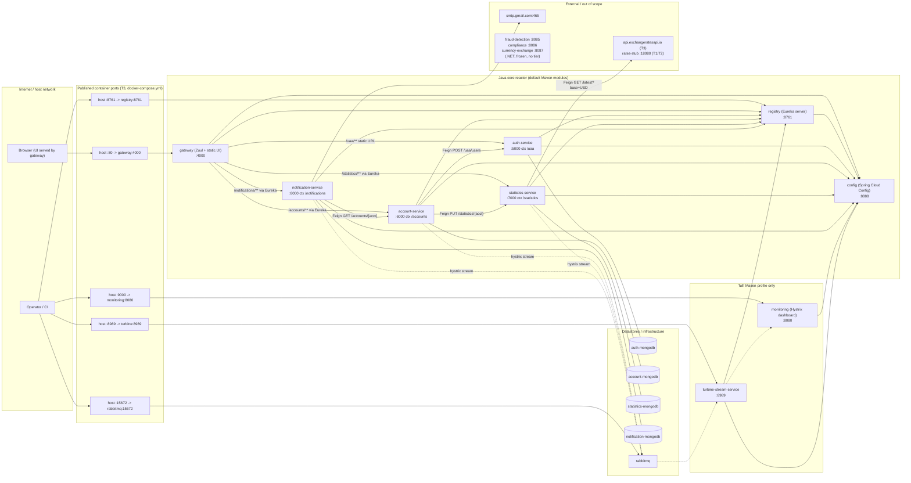

# As-is: system context and topology

Reverse-engineered from the branch `devin/1788845133-stage-0-demo-harness`.
Every claim below is traceable to a file in this repository; the citation is
given inline as `path:line`. Nothing here was confirmed against a running
instance — see [Open items for runtime verification](#open-items-for-runtime-verification).

Scope: the nine Maven modules of the Java stack. The three .NET Core 2.1
services (`fraud-detection-service`, `compliance-service`,
`currency-exchange-service`) are a frozen, out-of-scope boundary
(`docs/OUT-OF-SCOPE-DOTNET.md:1-12`); they are shown in the diagram only as
that boundary and appear in no run tier.

## 1. Component and deployment view

The diagram shows the T3 "full Java Compose" shape
(`docker-compose.yml`), which is the widest topology; T2 collapses the four
MongoDB containers into one and replaces the external rates API with a stub
(`docker-compose.core.yml:2-24`).

Internet-facing vs internal-only:

* Internet-facing (published to the host in T3): `gateway` (host `:80`),
  `registry` (`:8761`), `monitoring` (`:9000`), `turbine-stream-service`
  (`:8989`), `rabbitmq` management UI (`:15672`)
  (`docker-compose.yml:31-32,46-47,164-165,179-180,6-7`).
* Internal-only in T3: `config`, `auth-service`, `account-service`,
  `statistics-service`, `notification-service` and all four MongoDB
  containers — they declare no `ports:` in `docker-compose.yml`. Their ports
  are published only by the developer overlay `docker-compose.dev.yml:1-62`
  and by `docker-compose.core.yml` (T2), where every Java service and MongoDB
  is bound to the host (`docker-compose.core.yml:9-10,29-30,41-42,57-58,76-77,97-98,116-117,133-134`).

## 2. Service inventory

Port = the port the process listens on inside its own network namespace.
"Registers with Eureka" = the module declares an Eureka client and is not
disabled by configuration.

| Module | Listen port | `spring.application.name` | Registers with Eureka | Reachable through the gateway | Datastore / database |
| --- | --- | --- | --- | --- | --- |
| `config` | 8888 (`config/src/main/resources/application.yml:13-14`) | not set (no `bootstrap.yml`; defaults to `application`) | No — no Eureka client dependency (`config/pom.xml:19-28`) | No route (`shared/gateway.yml:19-42`) | none (serves `classpath:/shared`, `config/src/main/resources/application.yml:1-6`) |
| `registry` | 8761 (`shared/registry.yml:1-2`) | `registry` (`registry/src/main/resources/bootstrap.yml:1-3`) | Eureka **server**; does not self-register (`registry/src/main/resources/bootstrap.yml:11-16`) | No route | none |
| `gateway` | 4000 (`shared/gateway.yml:44-45`) | `gateway` (`gateway/src/main/resources/bootstrap.yml:1-3`) | Yes — `@EnableDiscoveryClient` (`gateway/src/main/java/com/piggymetrics/gateway/GatewayApplication.java:8-10`) | It **is** the gateway; also serves the static UI (`gateway/src/main/resources/static/index.html`) | none |
| `auth-service` | 5000, context `/uaa` (`shared/auth-service.yml:10-13`) | `auth-service` (`auth-service/src/main/resources/bootstrap.yml:1-3`) | Yes (`auth-service/src/main/java/com/piggymetrics/auth/AuthApplication.java:9-12`) | Yes — `/uaa/**`, routed by **static URL**, not by service id (`shared/gateway.yml:20-24`) | MongoDB `piggymetrics` on host `auth-mongodb` (default) / `piggymetrics_auth` on `${MONGO_HOST}` under `local` (`shared/auth-service.yml:1-8`, `shared/auth-service-local.yml:1-5`) |
| `account-service` | 6000, context `/accounts` (`shared/account-service.yml:19-22`) | `account-service` (`account-service/src/main/resources/bootstrap.yml:1-3`) | Yes (`account-service/src/main/java/com/piggymetrics/account/AccountApplication.java:11-16`) | Yes — `/accounts/**` via `serviceId` (`shared/gateway.yml:26-30`) | MongoDB `piggymetrics` on `account-mongodb` / `piggymetrics_accounts` on `${MONGO_HOST}` under `local` (`shared/account-service.yml:10-17`, `shared/account-service-local.yml:6-10`) |
| `statistics-service` | 7000, context `/statistics` (`shared/statistics-service.yml:19-22`) | `statistics-service` (`statistics-service/src/main/resources/bootstrap.yml:1-3`) | Yes (`statistics-service/src/main/java/com/piggymetrics/statistics/StatisticsApplication.java:21-26`) | Yes — `/statistics/**` via `serviceId` (`shared/gateway.yml:32-36`) | MongoDB `piggymetrics` on `statistics-mongodb` / `piggymetrics_statistics` under `local` (`shared/statistics-service.yml:10-17`, `shared/statistics-service-local.yml:6-10`) |
| `notification-service` | 8000, context `/notifications` (`shared/notification-service.yml:10-13`) | `notification-service` (`notification-service/src/main/resources/bootstrap.yml:1-3`) | Yes (`notification-service/src/main/java/com/piggymetrics/notification/NotificationServiceApplication.java:18-23`) | Yes — `/notifications/**` via `serviceId` (`shared/gateway.yml:38-42`) | MongoDB `piggymetrics` on `notification-mongodb` / `piggymetrics_notifications` under `local` (`shared/notification-service.yml:28-35`, `shared/notification-service-local.yml:6-10`) |
| `monitoring` (`full` profile) | no port configured — `shared/monitoring.yml` is empty, so the Spring Boot default 8080 applies; `monitoring/Dockerfile:7` exposes 8080 and `docker-compose.yml:164-165` maps host 9000 | `monitoring` (`monitoring/src/main/resources/bootstrap.yml:1-3`) | No — no Eureka client dependency and no `@EnableDiscoveryClient` (`monitoring/pom.xml:19-30`, `monitoring/src/main/java/com/piggymetrics/monitoring/MonitoringApplication.java:7-9`) | No route | none |
| `turbine-stream-service` (`full` profile) | no port configured — `shared/turbine-stream-service.yml` is empty; `turbine-stream-service/Dockerfile:7` exposes 8989 and `docker-compose.yml:179-180` maps 8989 | `turbine-stream-service` (`turbine-stream-service/src/main/resources/bootstrap.yml:1-3`) | Yes (`turbine-stream-service/src/main/java/com/piggymetrics/turbine/TurbineStreamServiceApplication.java:8-10`) | No route | none; consumes Hystrix streams over RabbitMQ (`turbine-stream-service/pom.xml:30-34`) |

Non-module runtime components:

| Component | Where | Port | Notes |
| --- | --- | --- | --- |
| `rabbitmq` | T3 only (`docker-compose.yml:3-11`) | 15672 published; 5672 published only by the dev overlay (`docker-compose.dev.yml:3-5`) | Spring Cloud Bus / Hystrix streams (`shared/application.yml:25-27`) |
| MongoDB (T3) | four containers built from `mongodb/Dockerfile` (`FROM mongo:3`) | 27017 internal; dev overlay publishes 25000/26000/27000/28000 (`docker-compose.dev.yml:25-26,35-36,45-46,55-56`) | one database per service, all named `piggymetrics` |
| MongoDB (T2) | single `mongo:7.0` container (`docker-compose.core.yml:2-15`) | 27017 published | four logical databases created by `mongodb/init/01-users.js:1-18` |
| `rates-stub` | T1/T2 (`scripts/demo/rates-stub.py`, `docker-compose.core.yml:17-22`) | 18080 | serves `GET /latest?base=USD` with USD/EUR/RUB/**JPY** (`scripts/demo/rates-stub.py:17-25`) |

The Java-side currency set is `USD, EUR, RUB, JPY` in both enums
(`account-service/src/main/java/com/piggymetrics/account/domain/Currency.java:5`,
`statistics-service/src/main/java/com/piggymetrics/statistics/domain/Currency.java:5`)
and in the rates map built by the statistics service
(`statistics-service/src/main/java/com/piggymetrics/statistics/service/ExchangeRatesServiceImpl.java:39-44`).

## 3. Runtime tiers

The four tiers are defined in `docs/RUNBOOK.md`.

| Tier | Definition | Components present |
| --- | --- | --- |
| **T0 — tests only** | `mvn -fae test` on the default reactor (`docs/RUNBOOK.md:7-19`) | No long-running components. The seven core modules compile and run their unit/slice tests; Eureka is disabled in every module's `src/test/resources/bootstrap.yml` and MongoDB is the embedded Flapdoodle instance (`spring.data.mongodb.port: 0`, e.g. `account-service/src/test/resources/application.yml:1-5`). JDK 8 is enforced by `maven-enforcer-plugin` (`pom.xml:57-79`). `monitoring` and `turbine-stream-service` are excluded unless `-Pfull` is used (`pom.xml:35-53`); CI runs both passes (`.github/workflows/build.yml:24-31`). |
| **T1 — bare JVMs** | `scripts/demo/start-local.sh` + `scripts/demo/smoke.sh` (`docs/RUNBOOK.md:21-31`) | 7 JVMs (`config`, `registry`, `auth-service`, `account-service`, `statistics-service`, `notification-service`, `gateway` — `scripts/demo/start-local.sh:76-108`), one local `mongod` on 27017 with auth (`scripts/demo/start-local.sh:46-55`), and the Python rates stub on 18080 (`scripts/demo/start-local.sh:40-44`). **No RabbitMQ, no monitoring, no Turbine.** Each JVM is capped with `-Xmx192m -XX:MaxMetaspaceSize=128m` (`scripts/demo/start-local.sh:64-65`). Profile `local`, config URI `http://localhost:8888` (`scripts/demo/start-local.sh:70-74`). |
| **T2 — core Compose** | `docker compose -f docker-compose.core.yml up` (`docs/RUNBOOK.md:68-81`) | Same nine processes as T1 but containerised: one `mongo:7.0`, the rates stub, and the seven Java services, each built from its own module `Dockerfile` (`docker-compose.core.yml:1-137`). Still no RabbitMQ, monitoring or Turbine. |
| **T3 — full Java Compose** | `docker compose --env-file .env -f docker-compose.yml up -d` (`docs/RUNBOOK.md:83-91`) | The original topology minus the .NET services: `rabbitmq`, `config`, `registry`, `gateway`, `auth-service`, `account-service`, `statistics-service`, `notification-service`, four MongoDB containers, plus `monitoring` and `turbine-stream-service` (`docker-compose.yml:3-183`). Uses the published `sqshq/piggymetrics-*` images unless the dev overlay is applied to build locally (`docker-compose.dev.yml`). |

## 4. Trust boundaries

### 4.1 External attack surface

T3 (`docker-compose.yml`) publishes exactly five host ports:

| Host port | Target | Authentication in front of it |
| --- | --- | --- |
| `80` → `gateway:4000` | Zuul + static UI | **None at the edge.** The gateway declares no Spring Security dependency (`gateway/pom.xml:19-43`); authentication is enforced downstream by each resource server. The static UI, `POST /accounts/`, and `GET /accounts/demo` are reachable anonymously (`account-service/src/main/java/com/piggymetrics/account/config/ResourceServerConfig.java:55-59`). |
| `8761` → `registry:8761` | Eureka dashboard and REST API | **None.** `registry/pom.xml:19-31` pulls no security starter and no security configuration exists in the module. The full service registry (hostnames, IPs, ports of every instance) is anonymously readable — `scripts/demo/start-local.sh:90-97` polls `http://localhost:8761/eureka/apps/AUTH-SERVICE` with no credentials. |
| `9000` → `monitoring:8080` | Hystrix dashboard | **None** (`monitoring/pom.xml:19-30` has no security starter). |
| `8989` → `turbine-stream-service:8989` | Aggregated Hystrix stream | **None** (`turbine-stream-service/pom.xml:20-38` has no security starter). |
| `15672` → `rabbitmq:15672` | RabbitMQ management UI | RabbitMQ's own default credentials; nothing in this repository configures them (`docker-compose.yml:3-11`). |

Ports published only by `docker-compose.dev.yml` (5672, 5000, 6000, 7000,
8000, 8888, 25000–28000) and by `docker-compose.core.yml` (27017, 18080, 8888,
8761, 5000, 6000, 7000, 8000, 4000) bypass the gateway entirely. In T2 the
resource servers are individually reachable on the host, so the gateway is not
a security boundary in that tier — it is only a convenience router.

### 4.2 Authentication at each boundary

* **Browser → gateway → resource servers.** Bearer tokens issued by
  `auth-service` via the password grant; each of `account-service`,
  `statistics-service` and `notification-service` is an OAuth2 resource server
  that validates the token by calling
  `security.oauth2.resource.user-info-uri` =
  `http://auth-service:5000/uaa/users/current`
  (`shared/application.yml:20-23`, `shared/application-local.yml:6-9`), through
  a copied-and-modified `CustomUserInfoTokenServices`
  (e.g. `account-service/src/main/java/com/piggymetrics/account/service/security/CustomUserInfoTokenServices.java`).
* **Service → service.** `client_credentials` with scope `server`
  (`shared/account-service.yml:1-8`, `shared/statistics-service.yml:1-8`,
  `shared/notification-service.yml:1-8`), injected into Feign calls by
  `OAuth2FeignRequestInterceptor` (e.g.
  `account-service/.../config/ResourceServerConfig.java:39-42`).
* **Service → config server.** HTTP Basic, user `user`, password
  `${CONFIG_SERVICE_PASSWORD}` (each module's `bootstrap.yml:4-9`;
  server side `config/src/main/resources/application.yml:9-11` and
  `config/src/main/java/com/piggymetrics/config/SecurityConfig.java:14-22`,
  which permits `/actuator/**` anonymously).
* **Service → MongoDB.** Username `user` with `${MONGODB_PASSWORD}` in the
  default profile (`shared/account-service.yml:10-17`). Under the `local`
  profile the `*-local.yml` files set only `host` and `database` and do **not**
  set `username`/`password`, so the credentials come from the non-local file
  they layer on top of.
* **Service → Eureka.** Unauthenticated.
* **Nothing authenticates the gateway itself to downstream services**; a caller
  that can reach `account-service:6000` directly is treated exactly like one
  arriving through Zuul.

## 5. Configuration contradictions observed

These are drift findings, each between two files that both claim to describe
the same thing:

1. **Gateway host port.** `80:4000` in `docker-compose.yml:46-47` vs
   `4000:4000` in `docker-compose.core.yml:133-134`; the smoke test assumes
   `http://localhost:4000` (`scripts/demo/smoke.sh:4`).
2. **MongoDB topology and database names.** Default profile: four hosts
   (`auth-mongodb`, `account-mongodb`, …), all using database `piggymetrics`
   (`shared/*.yml`). `local` profile: one host, four databases
   (`piggymetrics_auth`, `piggymetrics_accounts`, `piggymetrics_statistics`,
   `piggymetrics_notifications` — `shared/*-local.yml`,
   `mongodb/init/01-users.js:2-7`).
3. **MongoDB major version.** T3 builds `FROM mongo:3` (`mongodb/Dockerfile:1`)
   while T2 runs `mongo:7.0` (`docker-compose.core.yml:3`).
4. **Config server URI declared twice.** Every module hard-codes
   `http://config:8888` in `bootstrap.yml`, with no placeholder; T1 and T2 work
   only because `SPRING_CLOUD_CONFIG_URI` is injected as an environment
   variable (`scripts/demo/start-local.sh:70-74`,
   `docker-compose.core.yml:37`).
5. **Eureka zone.** `http://registry:8761/eureka/` (`shared/application.yml:16-18`)
   vs `http://${REGISTRY_HOST:localhost}:8761/eureka/`
   (`shared/application-local.yml:1-4`).
6. **Auth-service routing.** The gateway routes `/uaa/**` to a fixed URL rather
   than to the Eureka `serviceId` used for every other service
   (`shared/gateway.yml:20-24` vs `:26-42`), so `auth-service` registers with
   Eureka but is never resolved through it. This is confirmed by the T1
   observation in §6: `auth-service` was registered in Eureka as
   `AUTH-SERVICE`, while `/uaa/**` continued to use the static URL, so that
   registration was genuinely unused.
7. **Rates source.** `https://api.exchangeratesapi.io`
   (`shared/statistics-service.yml:24-25`) vs the local stub
   (`shared/statistics-service-local.yml:12-13`) vs `http://localhost:1` in
   tests (`statistics-service/src/test/resources/application.yml:15-16`).
8. **RabbitMQ presence.** `shared/application.yml:25-27` points every service
   at host `rabbitmq`, and three services depend on
   `spring-cloud-starter-bus-amqp` and `spring-cloud-netflix-hystrix-stream`,
   but T1 and T2 start no broker at all; the `local` profile only disables the
   bus (`spring.cloud.bus.enabled: false`, `shared/application-local.yml:11-16`),
   not the Hystrix stream binder.
9. **SMTP credentials are not externalised.** Unlike every other secret,
   `spring.mail.username`/`password` are literal values in
   `shared/notification-service.yml:36-40`.
10. **`monitoring` and `turbine-stream-service` set no `server.port`.** Their
    shared config files are empty; the port is asserted only by the Dockerfiles
    and the Compose mappings (`monitoring/Dockerfile:7`,
    `turbine-stream-service/Dockerfile:7`, `docker-compose.yml:164-165,179-180`).

## 6. Runtime observations (T1 tier, observed 2026-09-08, commit `d91f384`)

The following were observed on a running T1 stack (bare JVMs,
`scripts/demo/start-local.sh`). They are observations, not code citations, and
they say nothing about T2 or T3.

* `config` `GET http://localhost:8888/actuator/health` → **200**, so the T3
  `condition: service_healthy` gate does open. Note the fragility: `config/pom.xml`
  declares no `spring-boot-starter-actuator`, so actuator arrives transitively
  through `spring-cloud-config-server` (`config/pom.xml:19-28`). The healthcheck
  in `config/Dockerfile:7` therefore depends on an undeclared transitive
  dependency — precisely the kind of thing a dependency or Boot upgrade removes
  silently, with the failure surfacing as "no service ever becomes healthy in T3"
  rather than as a build error.
* `config` `GET /health` → **401**, confirming the Spring Boot 1.x actuator path
  is gone and only the `/actuator/**` prefix (permitted anonymously by
  `config/src/main/java/com/piggymetrics/config/SecurityConfig.java:14-22`) is live.
* Eureka registrations in T1: `GATEWAY`, `AUTH-SERVICE`, `ACCOUNT-SERVICE`,
  `STATISTICS-SERVICE`, `NOTIFICATION-SERVICE`. `monitoring` and
  `turbine-stream-service` are not part of T1, so their registration behaviour
  remains unobserved.
* The Eureka dashboard `GET http://localhost:8761/` → **200 unauthenticated**,
  confirming the trust-boundary claim in §4.1 by observation and not only by the
  absence of a security starter.
* `/hystrix.stream` → **404 on every one of 4000, 5000, 6000, 7000 and 8000**. No
  Hystrix stream endpoint exists anywhere in T1 (see §3 in the API contract
  inventory: Turbine has nothing to aggregate).
* `/actuator/health` → **404 on 5000, 6000, 7000 and 8000**; **200,
  unauthenticated, on 4000 (`gateway`) and 8761 (`registry`)**. Actuator is
  exposed on exactly the two infrastructure services and on none of the resource
  servers — the opposite of what the declared dependencies suggest, since the
  three resource servers declare `spring-boot-starter-actuator` while `gateway`
  and `registry` do not. Both live endpoints are additional unauthenticated
  surface on already-published ports (host `:80`→4000 and `:8761` in T3).

## Open items for runtime verification

These are the items still open after the T1 observations in §6. Those
observations cover T1 only and say nothing about T2 or T3.

1. **Effective port of `monitoring`.** Run `-Pfull` T3 and
   `curl -i http://localhost:9000/hystrix`; confirm the container really
   listens on 8080.
2. **Effective port of `turbine-stream-service`.** `curl -i http://localhost:8989/turbine.stream`
   in T3 and confirm the process bound 8989 rather than the Boot default 8080.
3. **Actual Eureka registrations per tier.** T1 is now observed in §6. The
   remaining open part is T2 and T3 only: run
   `curl -s -H 'Accept: application/json' http://localhost:8761/eureka/apps | jq '.applications.application[].name'`
   and compare against the "Registers with Eureka" column, in particular
   whether `turbine-stream-service` appears and `monitoring` does not in a
   `-Pfull` T3 run.
4. **Whether the Hystrix/Turbine AMQP path produces connection errors.** T1
   shows no `/hystrix.stream` endpoint anywhere. The remaining question is
   whether the AMQP stream binder produces connection-refused log loops in T2:
   check `docker compose -f docker-compose.core.yml logs account-service` for
   `spring-cloud-netflix-hystrix-stream` (`account-service/pom.xml:61-68`).
5. **MongoDB credentials under the `local` profile.** Confirm that the
   `*-local.yml` overlays inherit `username: user` / `${MONGODB_PASSWORD}` from
   the non-local files by checking `curl -u user:$CONFIG_SERVICE_PASSWORD http://localhost:8888/account-service/local`
   and looking for `spring.data.mongodb.username` in the merged property
   sources.
6. **T3 without `monitoring`/`turbine` images built.** `docker-compose.yml`
   references `sqshq/piggymetrics-*` images from Docker Hub; verify whether
   those still exist and are Java 8 images, or whether T3 requires
   `docker-compose.dev.yml` builds in practice.
